>#  Implementation
___________

A folder is made which serves as a container for the captured imagery (custom imagery), TFrecord (feature tensor), and configuration document, i.e., 111-132 kV overhead transmission lines imagery with 4000 x 3000 resolution.

Common Problems associated in Deep learning via Object Detection (OD) incluse small scale objects, intra-class variation and class imbalance. In order to handle the presence of small-scale objects, i.e., identified visually by aspect ratio (width-height value) and scale of the interested EPTN faults in the image to that of the captured dataset; the image is split into tiles of equal size centred on the object of interest, neglecting other areas not associated with the problem to investigate.

-  First the rasterio and PIL is installed.
-  Next, the image is splitted into [tiles](../codes/slice_into_tiles.py)
-  For other dataset with varying size, i.e., not in the form of the nearest whole number or consisting of more than 1 significant figure – a non-destructive method is used. The aspect ratio is maintained by constant value using the [`resize script`](../codes/resize_images.py) as well as the [`resize -> pad approach`](../codes/size_pad_images.py).
_________


1. ### Generating Ground truth boxes
- [LabelImg](https://github.com/tzutalin/labelImg) was downloaded and installed. This is used to draw the ground truth boundary box of faults presence in the image.
*“Data annotation is the mechanism where data is labelled or tagged for supervised learning methods. When detecting objects in a shot, annotation is the method of naming the object in the image. The bounding box technique and pixel-wise frame segmentation are two approaches used for object annotation. We used the bounding box annotation method whereby a drawing was rendered by defining the object position and then drawing a rectangular box around the object boundary.”*


    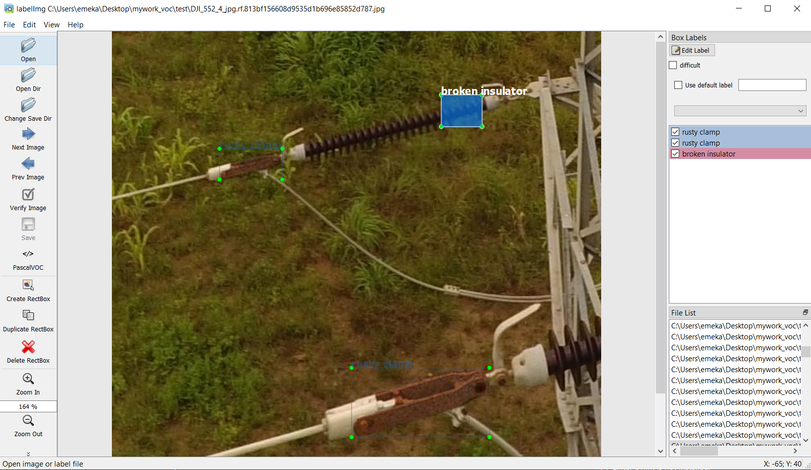
    >*Fig 3.1 Labelling image via LabelImg*
- The final output from the LabelImg generates labels/bounding box saved as an XML format (VOC2007/extensible mark-up language) accompanying  the images. The XML file format includes the image and details about the object in a rectangular frame, and how it corresponds to a class of object/s.

    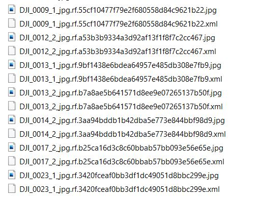
    >*Fig 3.2 Generated ground truth label for corresponding images*
- The annotated XML file to visualize the object with the ground truth bounding box can be accessed with the browser/text editing software. This is a test to verify if annotation mistakes were made during the text extraction. More precisely when the annotation is performed in an automatic manner, displaying the created annotation file on the browser is a promising idea to observe the output and check if there is a need to change the annotation or not.

______________
1. ### Data Exploration

   This involved the following:
 - Accessing the general feel of the dataset and inspecting it visually.
 - Making sure it is not corrupted and does not contain any obvious artifacts (for instance black only images)
 - Making sure that all the files are readable
____________

3.  ### Data splitting and Transformation
 - The image patches and all their corresponding annotations (image chip) are split randomly into training, validation, and test dataset. This is achieved using [partitioning.py](../codes/partitioning.py).
 - Next, the ground truth annotation is converted to first to command comma separated value (.csv). The XML file store the information of ground truth bounding box on top of the object as well as the classification labels in the RGB image. This is implemented using the xml_to_csv.py script.
    >`“python` [xml_to_csv.py](../codes/xml_to_csv.py) `--inputDir= [absolute path to the xml. Folder directory for train/validation/test] --outputFile= [absolute path to where you want to store the csv file train/validation/test including the file name with file extension (.csv)] --labelMapDir = [absolute path to where you want to store the Labeled Objects group of the Image Classification for train/validation/test including the file name with file extension (.pbtxt)]”`

    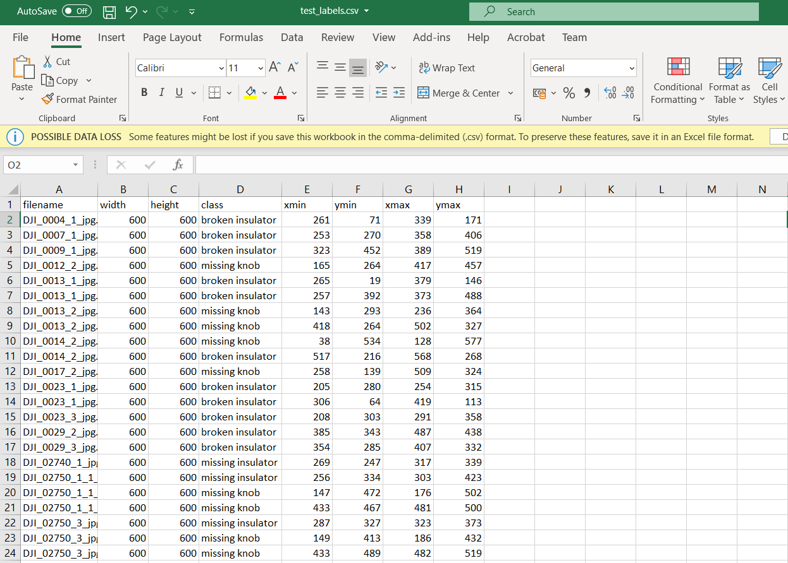
    >*Fig 3.3 csv output generated by xml_to_csv*

    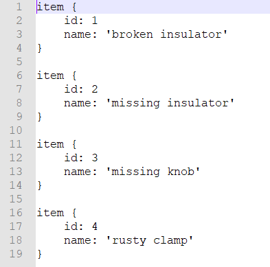
    >*Fig 3.4 label output generated by xml_to_csv*

 - Following this, the csv data is combined with their corresponding images to create the TFrecord features using 
    >`“python` [generate_tfrecords.py](../codes/generate_tfrecords.py) `--csv_input= [absolute path to the saved csv file from the previous stage for train/validation/test] --image_dir= [absolute directory to the folder housing the train/validation/test images] --output_path= [absolute path to where you want to store the csv file train/validation/test including the file name with file extension (.record)]”`

    where:
    * csv_input: the path to the .csv file
    * image_dir: the path to the directory that contains the images we will use for building the model.
    * output_path: the path to the new .record file that will be created.
NOTE: The generate_tfrecords requires the function responsible for identifying the different class of interest (EPTN faults).

    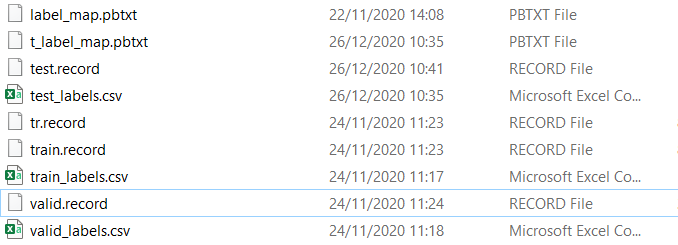
    >*Fig 3.5 Data Transformation output*

_________

4. ### Model Building by Configuration
 - The TensorFlow object detection API is deep learning framework built on top of TensorFlow used for object detection. It is popular among the researcher community because of its easiness to build, train and deploy. There are various models of pretrained object detection models trained on the COCO (Common Objects in Context) dataset, Paschal VOC datasets, Kitti datasets and open-image datasets. TensorFlow model zoo offers numbers of pretrained models trained on various datasets, including COCO trained models, other trained models. Here, SSD meta-architecture with the resnet50, resnet 101 and mobilenet backbone models pretrained on coco and open image dataset were downloaded and utilized, namely:
 	```
    ssd_mobilenet_v1_fpn_shared_box_predictor_640x640_coco14_sync_2018_07_03.tar
 	ssd_resnet101_v1_fpn_shared_box_predictor_oid_640x640_sync_2019_01_20.tar
 	ssd_resnet50_v1_fpn_shared_box_predictor_640x640_coco14_sync_2018_07_03.tar
     ```
 - From the *‘sample’* folder under the object_detection directory, the matching [config file](../config) to these models stated above are grabbed, compiled, and developed as follows:
    ```
    ssd_resnet50_v1_fpn_shared_box_predictor_640x640_coco14_sync.config
    ssd_resnet101_v1_fpn_shared_box_predictor_oid_640x640_sync.config
    ssd_mobilenet_v1_fpn_shared_box_predictor_640x640_coco14_sync.config
    ```
Using the notepad ++ text editor, the configuration file was modelled and developed. The changes made to the .config file, include changing the number of classes and examples, adding the file paths to the training data, and others as described below.
> a. Defining the Output class label and Box Encoding
    
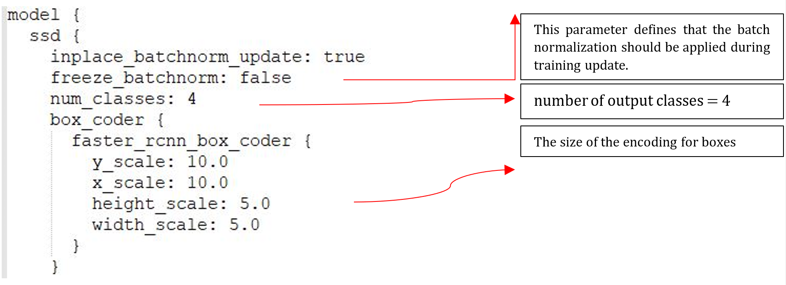
>*Fig 3.6 Defining the Output class label and Box Encoding.*

> b. Bounding Box Model Definition

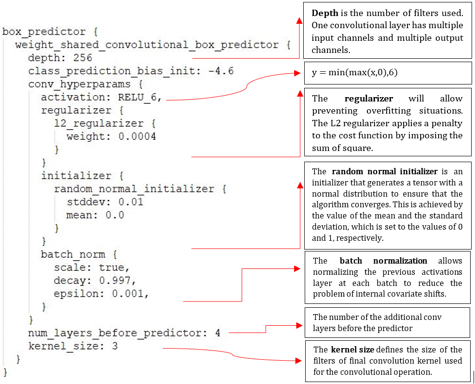
>*Fig 3.7 Bounding Box Model Definition*

> c. Feature Extractor Network Development

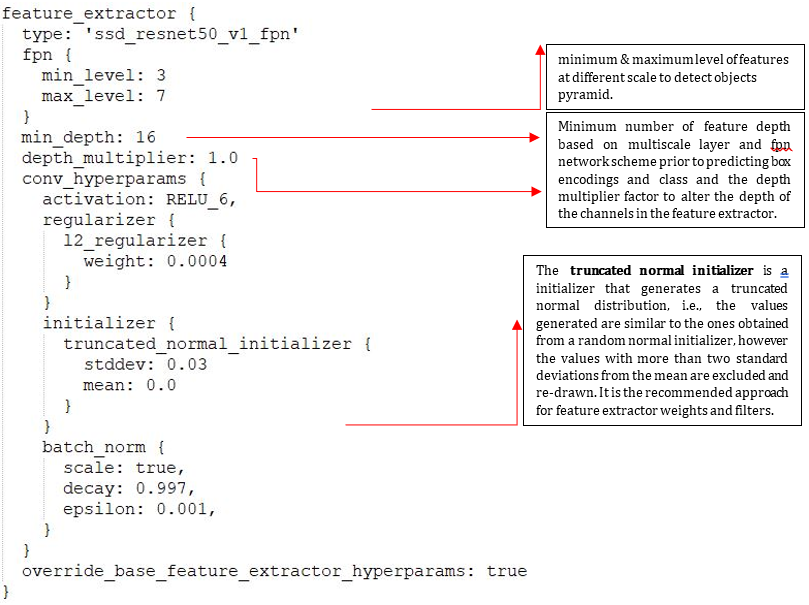
>*Fig 3.8 backbone architecture network modelling*


> d. Using Custom Losses and Metrics

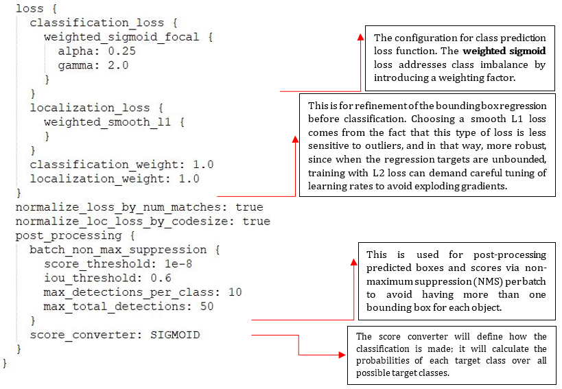
>*Fig 3.9 Loss Optimization*


> e. Default Box Generation

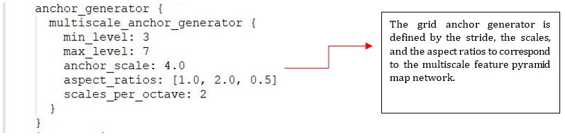
>*Fig 3.10 Anchor Generation*


> f. Extracting features using the pretrained convolutional base and Data Augmentation Image Generator

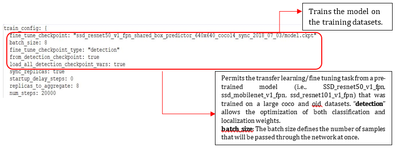
>*Fig 3.11 Transfer Learning Configuration*


> g. Compiling the model and Instantiating Training

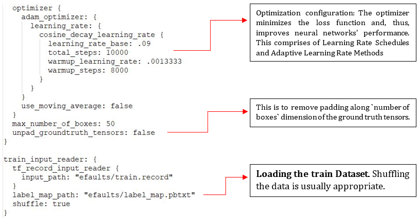
>*Fig 3.12 Compiling the Model*


> h. Setting and Saving the validation logs at each fold

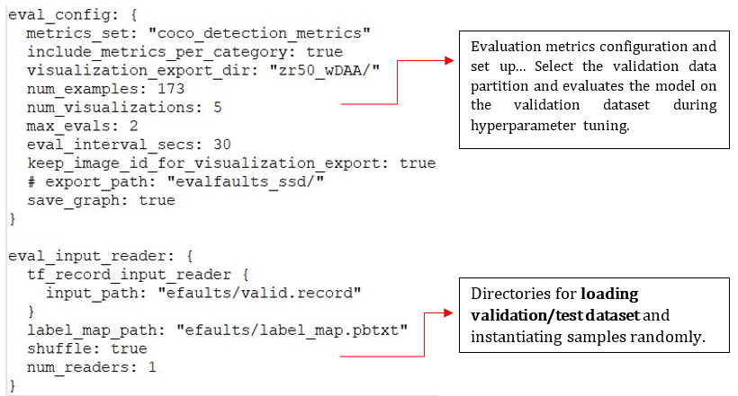
>*Fig 3.13 Validation Approach*

`NOTE:`All the image datasets are maintained in the folder created for the implementation. Further information can be obtained from the protos. The paths for Loading training/validation/test dataset are entered with single forward slashes (not backslashes), else a file path error when trying to train the model is generated in TensorFlow! Also, the paths are in double quotation marks (“), not single quotation marks (‘) as it is a string.
____________

5. ### Execution
   From the \object_detection directory, the following command is used to begin training:
   ```
   python model_main.py --alsologtostderr \
   --pipeline_config_path=${PIPELINE_CONFIG_PATH} \
   --model_dir=${TRAIN_DIR} \
   --num_train_steps= 24000 \
   --sample_1_of_n_eval_on_train_examples= 65 \
   --num_eval_steps= 100 \
   --sample_1_of_n_eval_examples= 1 \
   --eval_training_data= True

   For instance;
   !python model_main.py --model_dir= zr50_wDA/ --pipeline_config_path= zr50_wDA/ssd_resnet50_v1_fpn_shared_box_predictor_640x640_coco14_sync.config --sample_1_of_n_eval_on_train_examples= 65 --num_eval_steps= 65 --eval_training_data= True –logtostderr
   ```

   --pipeline_config_path: path to "pipeline.config" file used to train detection model. This file should include paths to the TFRecords files (train and test files) that you want to evaluate, as seen in Figure 3.7 and 3.8.

   --model_dir/train_dir: Output directory where resulting metrics will be written, particularly "events.*" files that can be read by tensorboard.

   --checkpoint_dir: Directory holding a checkpoint. That is the model directory where checkpoint files ("model.ckpt.*") has been written, either during training process, or after exporting it by using "export_inference_graph.py".

   --run_once: True to run just one round of evaluation.

    `NOTE:` To evaluate using model_main.py after training, the checkpoint_dir is added in the command. After training, the model_dir would be the checkpoint_dir in the evaluation session since that is where the checkpoints are. A substitute to the model_main.py script is the train.py script for training. The model_main.py is used for training and evaluating the model. When using train.py we run a separate program for evaluation (eval.py), while model_main.py executes both. Both methods were adopted for this study, when necessary. A sample of the train.py script command is displayed below.
   ```
   !python legacy/train.py \
   --train_dir=training_B1/ \
   --pipeline_config_path= zr50_wDA/ssd_resnet50_v1_fpn_shared_box_predictor_640x640_coco14_sync.config.config \
   --logtostderr=true
   ```

   For the train.py a separate program is run for evaluation called eval.py script as seen below:
   ```
   !python legacy/eval.py \
   --logtostderr \
   --checkpoint_dir= path/to/checkpoint \
   --eval_dir= path/to/eval \
   --pipeline_config_path= path/to/config
   ```

   About every 5 minutes the current loss gets logged to Tensorboard. For tensorboard visualization during training and evaluation, in the the object_detection folde, the following commands are run:
   ```
   %reload_ext tensorboard
   %tensorboard --logdir zr50_wDA
   ```

   where logdir is the directory whose activity was logged in the model_dir. 

    The tensorflow boards opens in a browser window to [localhost:6006](localhost:6006) and model's histograms, graphs, etc. is checked.

   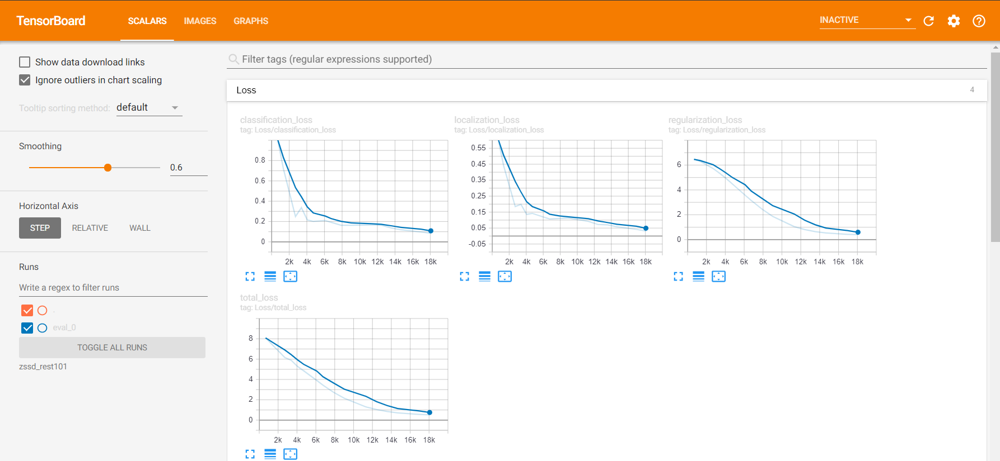
   >*Fig 3.14 Sample of tensorboard to monitor training and evaluation with ssd_resnet 101*
______________


1. Exporting Inference Graph

    The trained model generates model weights which have learnt the problem and all its varying context saved in the model directory/config directory in the form model.ckpt-xxxx, where xxxx represents the last checkpoint at which the optimized trained weights of the complete model tuned to understand the problem during or after training is saved. model we need to generate an inference graph, which can be used to run the model. For doing so we need to first of find out the highest saved step number. 
    
    ```
    !python export_inference_graph.py \
    --input_type= {INPUT_TYPE} \
    --pipeline_config_path= {PIPELINE_CONFIG_PATH} \
    --trained_checkpoint_prefix= {TRAINED_CKPT_PREFIX} \
    --output_directory= {EXPORT_DIR}
    ```
________________
7. ### Testing and Inferencing with New Developed Model
   The appropriate object detection classifier model is downloaded and .

    Before running the [Python scripts](../codes/updated_old_example.py), several modification is made such as the NUM_CLASSES variable in the script to equal the number of classes you want to detect. (For this implementation, there are four electric power transmission component faults detected, so NUM_CLASSES = 4.)


    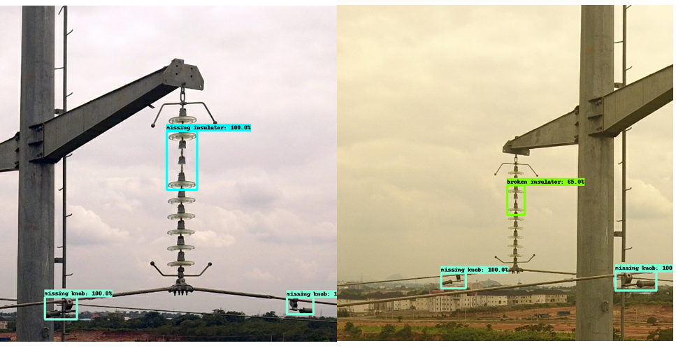
    >*Fig 3.15 Sample of result*
__________

8. ### Accuracy Assessment
   
   To achieve this, first the infer_detection within the TFOD API (models\research\object_detection\inference) is utilizes the model inference graph to detect and classify faults on the test image and then the [confusion matrix](../codes/confusion_matrix.py) generated to assess the performance of the model.
   ```
   python infer_detections.py --input_tfrecord_paths= "Test record from section 3. Data Splitting and Transformation" --output_tfrecord_path= "Result of detection in .record format " --inference_graph=" Inference graph of model used for detection- frozen_inference_graph.pb"

   python confusion_matrix.py --detections_record= detection result from the infer_detection module- testing_detections.record --label_map=label_map.pbtxt --output_path=confusion_matrix.csv
   ```

    <p align="center">
        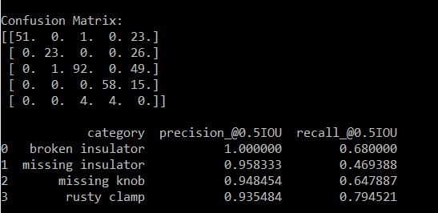
    </p>
    
    <p align="center">
        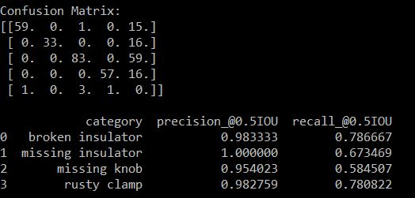
    </p>

    <p align="center">
        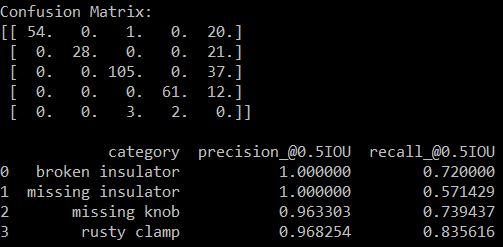
    </p>
    <p align="center">
    Fig 3.16 Confusion matrix Generated: top(mobilenet), middle (resnet 101) and bottom (resnet 50)*
    </p>
______________

### For Training and Configuration on colab, click [here](../codes/Training_Model.ipynb)

##### | [`Back to the top`](#implementation)| [`Previous Page`](Installation.md) | [`Next Page`](References.md) |
| [Go Back](../README.md) |
------
