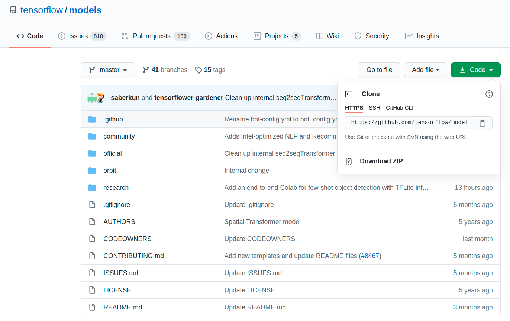

>#  Installation and Setup

________________________
## Prerequisites
----------------
To build a Tensorflow object detection model, you should have certain prewrequises installed on your system and should employ the following steps below:

1. Install Anaconda, CUDA, and cuDNN
   - check the [website](https://www.anaconda.com/products/individual) and click [here](https://www.tensorflow.org/install/source#tested_build_configurations) *for more info*

2. Set up the TensorFlow Directory and Anaconda Virtual Environment

   Clone the full TensorFlow object detection repository located at https://github.com/tensorflow/models by clicking the “Clone or Download” button. With the downloaded and extracted zip file, the “models-master” named “models” becomes accessible.

   
    >* Tensorfow object detection API (TFOD) repository*
   - Next, cretae the Anaconda virtual environment (venv) via: | ```conda create -n ‘name of new env’ python=3.6``` and then activate this new environment using: ```conda activate *‘name of new env’*```.
   - The TensorFlow Object Detection API requires using the specific directory structure as provided in its GitHub repository.To make sure that TFOD is properly installed the following package should be installed within the virtual environment:
        ```(‘name of new env’) C:\>python -m pip install --upgrade pip
            (‘name of new env’) C:\>pip install TensorFlow==1.15
            (‘name of new env’) C:\> pip install pillow
            (‘name of new env’) C:\> pip install lxml
            (‘name of new env’) C:\> pip install Cython
            (‘name of new env’) C:\> pip install contextlib2
            (‘name of new env’) C:\> pip install jupyter
            (‘name of new env’) C:\> pip install matplotlib
            (‘name of new env’) C:\> pip install pandas
            (‘name of new env’) C:\> pip install tf_slim
        ```
3. Configure the PYTHONPATH environment variable
   -  Create a PYTHONPATH variable to point to the \models, \models\research, and \models\research\slim directories using the following commands (from any directory):
            ```(‘name of new env’) C:\> set PYTHONPATH=C:\tensorflow1\models;C:\tensorflow1\models\research;C:\tensorflow1\models\research\slim```
4. Compile Protobufs and run setup.py
    - Next, protoc 3.4 should be downloaded (only this version works appropriately) and then move the protoc.exe into the ‘research’ folder of the cloned repository. This is used by TensorFlow to configure model and training parameters. Next, from the ‘research’ directory, the command below should be run to compile protoc: ```protoc object detection/protos/*.proto --python_out=.```
    - Next, to run the object_detection scripts on the local machine, navigate to the ‘research’ directory and within the ‘research’ directory, the following two commands should be run:
        ```
        Python setup.py build
	    Python setup.py install
        ```
    - To allow proper metrice evaluation, the pycocotools should be installed using 
        ```pip install git+https://github.com/philferriere/cocoapi.git#egg=pycocotools^&subdirectory=PythonAPI```
__________

How to Use this Project
-----------------------
### Step 1: Download or git clone the repository and copy it under object_detection. Now your file structure should be: \
-models \
&nbsp;&nbsp;&nbsp;&nbsp;-research \
&nbsp;&nbsp;&nbsp;&nbsp;
&nbsp;&nbsp;&nbsp;&nbsp; -object_detection \
&nbsp;&nbsp;&nbsp;&nbsp;
&nbsp;&nbsp;&nbsp;&nbsp; &nbsp;&nbsp;&nbsp;&nbsp; - \
&nbsp;&nbsp;&nbsp;&nbsp; &nbsp;&nbsp;&nbsp;&nbsp; ... \
&nbsp;&nbsp;&nbsp;&nbsp; ...


### Step 2: Open [Colab notebook](../codes/updated_old_example.py)
- Edit the code where necessary and run it.

Requirements:
- `frozen_inference_graph.pb` Frozen TensorFlow object detection model in the developed models in inference folder from github. 
- `label_map.pbtxt` File used to map correct name for predicted class index in the developed models in inference folder from github.

___________
##### | [`Back to the top`](#installation-and-Setup) | [`Previous Page`](Introduction.md) | |[`Next Page`](Implementation.md) |
| [Go Back](../README.md) |
----